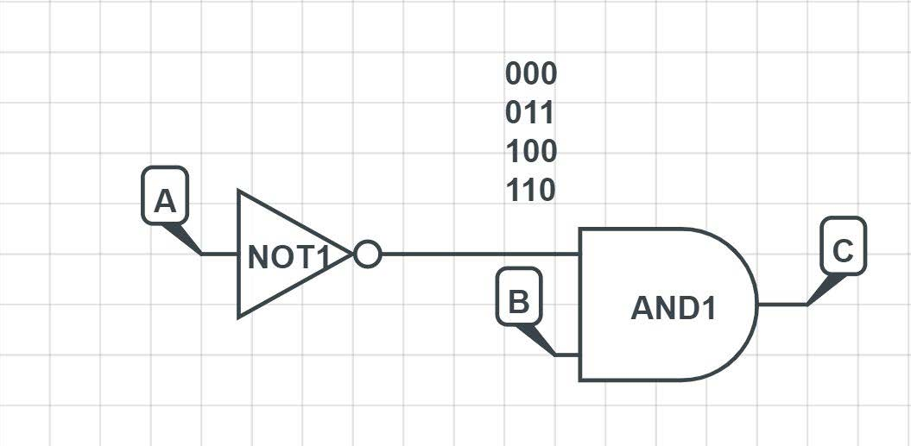
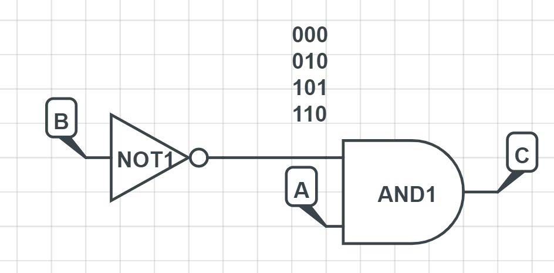
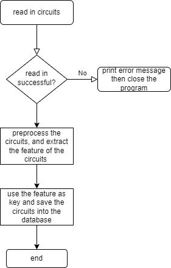
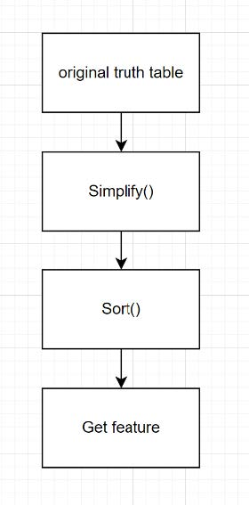

# Circuit-de-duplication-storage


## INTRODUCTION

Designing new circuits takes time, so checking if a specific function has already been developed is a better approach. 

The simplest way to describe a circuit is through its truth table. But several problems need to be solved before we can search for circuits.

1. The same circuit may have different truth tables.
    - Let's take a simple circuit as an example:
    - 
    - If you change the order of the two input signals, the truth table change to the following form:
    - 
    - The two circuits are the same, but they have different truth tables
    - So we can't just compare two truth tables to see whether two circuits are the same
2. It takes too long to check the whole table.
    - If we have a circuit with 10 inputs, there are 2^10 = 1024 rows in the truth table
    - If we want to check whether two circuits are the same, we need to check 1024 rows
    - It takes too long to check the whole table
    - So we need to find a way to check the truth table more efficiently


## PROCEDURE



And the essential part of the program is the preprocessing part.




- Simplify
    - only keep the rows that have a non-zero output to a new simplified table
- Sort
    - Sort has two-part, the first part is row sort, the second part is col sort
    - he whole operation is done on the simplified table created before,
    - First, the sum of each row will be calculated
        - The sorting part is calling sort from the algorithm header. And a custom compare function is provided.
            - In the custom compare function, all the elements are sorted based on the sum, ascending order. And for those rows that have the same sum, we compare each element in both rows
                - For example: 010 and 001. They have the same sum, 001's second element is smaller than 010's second element, so 001 is smaller than 010.
                - There won't be two identical rows as stated in the prerequisite.
        - Then we can move the rows according to the sorting result to a new tempForm table.
        - The col sort part is similar to the row sort part
            - One notable thing is that there may be duplicates when performing col sort. When two columns are identical, we sort them as their original form.
- After sorting, all the different forms of truth tables of the same circuits will be the same canonical form table.
    - The structure of the feature vector is:
        - Number of inputs || number of outputs || number of simplifiedRow || all the row sum of canonicalForm truth table || all the col sum of canonicalForm truth table
        ``` C++
        void circuit::setFeatureOfCircuit() {
            standardize();
            feature.push_back(inputs);
            feature.push_back(outputs);
            feature.push_back(simplifiedRowNum);

            auto rowSum = finRowSum();
            for (const auto &item: rowSum) {
                feature.push_back(item);
            }
            auto colSum = finColSum();
            for (const auto &item: colSum) {
                feature.push_back(item);
            }

        }
        ```

The next part is to save circuits to the database

- The database is MySQL
    - The table is called circuit
    - The table has 3 columns: id, feature, location
    - The id is the primary key, and it is auto-increment
    - The feature is the feature vector of the circuit
    - It is the hash of the canonical form of the circuit
    - The location is the location of the circuit in the file system


## IMPROVEMENT

For this program to support sequential gate. 

We can set the first column in the truth table as the time and separate the truth table into time, input and output. 

And in the output feature part, we can also push the sum of time into the feature vector. Simply put, just treat the time as another column of input.


## REFERENCE

1. Q. Wu, C. Y. R. Chen and J. M. Acken, "Efficient Boolean matching algorithm for cell libraries," Proceedings 1994 IEEE International Conference on Computer Design: VLSI in Computers and Processors, 1994, pp. 36-39, doi: 10.1109/ICCD.1994.331849.
2. STD::Hash. cplusplus.com. (n.d.). Retrieved December 14, 2021, from https://www.cplusplus.com/reference/functional/hash/.
3. Std::UNORDERED_MAP. cplusplus.com. (n.d.). Retrieved December 14, 2021, from https://www.cplusplus.com/reference/unordered_map/unordered_map/.